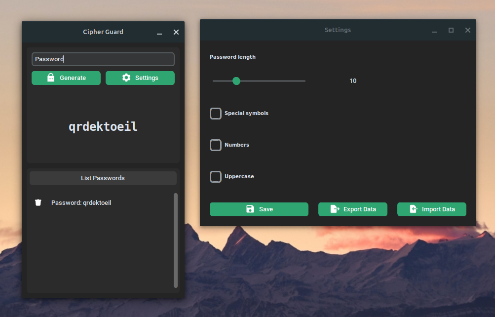

<p align="center">
  <a>
    
  </a>

  <h3 align="center">Cipher Guard</h3>

  <p align="center" >
     Application developed with the purpose of generating highly secure passwords for web applications and other online services. The differentiator is that all operations are performed locally, without an internet connection, ensuring maximum security and privacy of your data.
  </p>
</p>
&nbsp;
<div align="center" >
    <a href="#about">About</a>
    - 
    <a href="#quick-start">Quick start</a>
    -
    <a href="#tech-stack">Tech Stack</a>
    -
    <a href="#license">License</a>

&nbsp;

  



</div>

## About

Desktop app that generates secure passwords with symbols, numbers, and uppercase letters, allowing adjustment of the desired length. Additionally, it features data export and import functionalities to ensure portability and security of your passwords. Developed with TKinter, it provides an intuitive and visually appealing experience.

## Quick start

### Linux

1. Download Cipher Guard
2. Give the file permission

```
chmod +x CipherGuard
```

3. Double click Cipher Guard

### Windows

1. Download Cipher Guard
2. Give permission it file
   `chmod +x CipherGuard`
3. Double click Cipher Guard or code in folder that contain Cipher Guard:
   `./CipherGuard`

## Tech Stack

- [Custom Tkinter](https://customtkinter.tomschimansky.com/)
- [Python](https://www.python.org/)
- [Pyinstaller](https://pyinstaller.org/en/stable/)
- [SQLite](https://www.sqlite.org/)

## License


